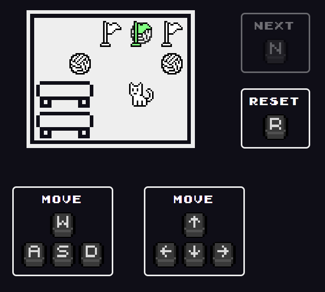

# Push Push Game
A simple block-pushing puzzle game built with **HTML, CSS, and JavaScript**.  

---

## 🎮 Gameplay Screenshot

> Replace this with an actual screenshot of your game (`screenshot.png` in the repo root).  

---

## Address
👉 [Play the Game](https://jeon-chanyoung.github.io/push_push_game)

---

## 🛠️ Tech Stack
- HTML  
- CSS  
- JavaScript  

---

## 📖 How to Play
- Use the **arrow keys** (↑ ↓ ← →) to move the character.  
- Push all boxes onto the marked goal positions.  
- Clear all stages by solving the puzzles!  
